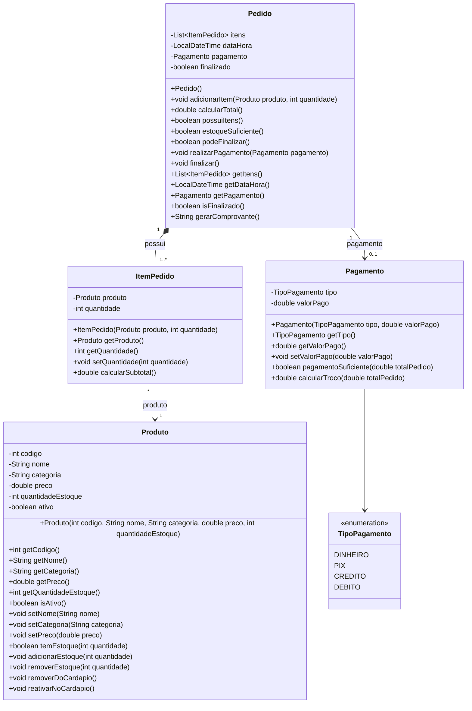

# GradedIndividualTask — Sistema de Vendas da Cantina Escolar

Projeto desenvolvido em Java para a atividade **Da Modelagem à Implementação em Java**.

## Integrantes

- Nome: ______________________________________
- Turma: _____________________________________
- Professor(a): _______________________________

---

# 1. Casos de Uso

## 1.1 Atores

### Cliente
Pode consultar o cardápio, escolher produtos, informar quantidades e realizar o pagamento.

### Atendente
Pode registrar a venda, receber o pagamento e emitir o comprovante.

### Gerente
Pode cadastrar produtos, alterar preços, atualizar estoque, remover produtos do cardápio e consultar vendas.

---

## 1.2 Casos de Uso Principais

1. Consultar cardápio
2. Escolher produtos
3. Informar quantidade
4. Criar pedido
5. Adicionar item ao pedido
6. Calcular total do pedido
7. Realizar pagamento
8. Validar pagamento
9. Calcular troco
10. Finalizar pedido
11. Emitir comprovante
12. Cadastrar produto
13. Alterar preço
14. Atualizar estoque
15. Remover produto do cardápio
16. Consultar vendas

---

## 1.3 Caso de Uso — Realizar Venda

**Objetivo:** registrar uma compra e finalizar o pagamento.

**Atores:** Cliente e Atendente.

### Fluxo principal

1. O cliente consulta o cardápio.
2. O cliente escolhe os produtos.
3. O atendente informa os produtos e suas quantidades.
4. O sistema verifica o estoque.
5. O sistema adiciona os produtos ao pedido.
6. O sistema calcula o subtotal de cada item.
7. O sistema calcula o valor total do pedido.
8. O cliente informa a forma de pagamento.
9. O atendente informa o valor pago.
10. O sistema verifica se o pagamento é suficiente.
11. O sistema registra a data e hora da venda.
12. O sistema atualiza o estoque.
13. O pedido é finalizado.
14. O sistema emite o resumo da venda.

### Fluxo alternativo — estoque insuficiente

1. O cliente solicita uma quantidade maior que o estoque disponível.
2. O sistema informa que não existe estoque suficiente.
3. O item não é adicionado ao pedido.

### Fluxo alternativo — pagamento insuficiente

1. O cliente informa um valor inferior ao total.
2. O sistema informa que o pagamento é insuficiente.
3. O pedido permanece aberto até que um pagamento suficiente seja informado.

---

## 1.4 Caso de Uso — Cadastrar Produto

**Objetivo:** permitir ao gerente cadastrar um novo produto.

**Ator:** Gerente.

### Fluxo principal

1. O gerente solicita o cadastro.
2. O sistema solicita código, nome, categoria, preço e estoque.
3. O gerente informa os dados.
4. O sistema valida os dados.
5. O produto é cadastrado.
6. O produto passa a fazer parte do cardápio.

### Fluxo alternativo — código já utilizado

1. O gerente informa um código já cadastrado.
2. O sistema identifica a duplicidade.
3. O cadastro não é concluído.

---

# 2. Diagrama de Classes

O diagrama está disponível no arquivo `diagrama.puml`.

Também pode ser visualizado diretamente pelo código abaixo:



## Relacionamentos

- `Pedido` possui `1..*` `ItemPedido`: **composição**.
- `ItemPedido` referencia `1` `Produto`: **associação**.
- `Pedido` possui `0..1` `Pagamento`: **associação**.
- `Pagamento` utiliza `TipoPagamento`: **associação/dependência com enum**.

---

# 3. Implementação

## Classes

- `Produto`
- `ItemPedido`
- `Pedido`
- `Pagamento`
- `TipoPagamento`
- `Main`

## Responsabilidades

### Produto
Representa um produto comercializado pela cantina e controla preço, estoque e disponibilidade.

### ItemPedido
Representa um produto dentro de um pedido e calcula seu subtotal.

### Pedido
Mantém a lista de itens, calcula o total, controla pagamento, valida as condições de finalização e atualiza o estoque.

### Pagamento
Registra o tipo de pagamento e o valor pago. Também verifica se o valor é suficiente e calcula o troco quando o pagamento é em dinheiro.

### TipoPagamento
Enumeração que representa as formas de pagamento aceitas.

### Main
Executa uma simulação completa de uma venda.

---

# 4. Como executar

É necessário ter o Java JDK instalado.

No terminal, dentro da pasta `src`:

```bash
javac *.java
java Main
```

Ou, utilizando uma IDE como IntelliJ IDEA, Eclipse ou VS Code, basta abrir o projeto e executar a classe `Main`.

---

# 5. Exemplo de funcionamento

O programa cadastra:

- 10 coxinhas a R$ 6,50;
- 8 sucos de laranja a R$ 5,00;
- 20 brigadeiros a R$ 3,00.

Depois cria um pedido contendo:

- 2 coxinhas = R$ 13,00;
- 1 suco = R$ 5,00.

Total:

**R$ 18,00**

Pagamento:

**Dinheiro — R$ 20,00**

Troco:

**R$ 2,00**

Após a finalização:

- Coxinhas: 8 unidades;
- Sucos: 7 unidades;
- Brigadeiros: 20 unidades.

---

# 6. Regras de negócio implementadas

- Um produto possui código, nome, categoria, preço e estoque.
- Produtos possuem controle de disponibilidade no cardápio.
- Um pedido possui um ou mais itens para ser finalizado.
- Cada item possui produto e quantidade.
- O subtotal é calculado por `preço × quantidade`.
- O total é calculado pela soma dos subtotais.
- O pagamento não calcula o total do pedido.
- O pagamento verifica se o valor é suficiente.
- Pagamentos em dinheiro podem gerar troco.
- Produtos sem estoque não podem ser vendidos.
- O estoque é reduzido quando a venda é finalizada.
- O pedido registra data e hora.
- Produtos podem ter o preço alterado.
- Estoque pode receber novas entradas.
- Produtos podem ser removidos do cardápio sem serem apagados do sistema.
